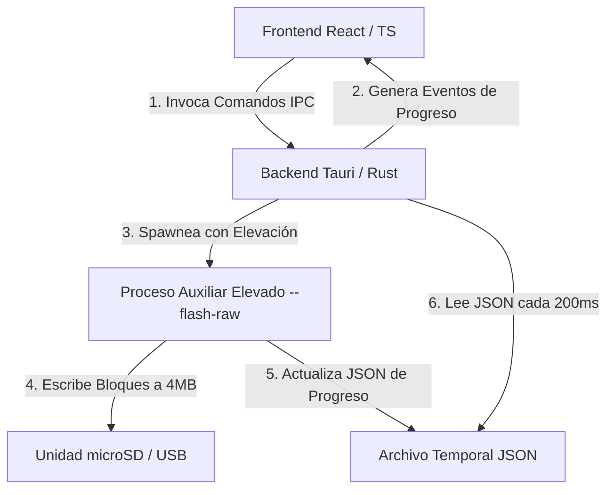

# ⚡ Funcionamiento Interno de Sigil Flash

Sigil Flash es una aplicación de escritorio multiplataforma diseñada para descargar, verificar, flashear imágenes de sistemas operativos (como Raspberry Pi OS, Ubuntu, etc.) en tarjetas microSD o unidades USB, y personalizar su configuración inicial (Wi-Fi, SSH, usuario, etc.) antes del primer arranque.

Este documento detalla la arquitectura de la aplicación, el flujo de ejecución, la elevación de privilegios y el funcionamiento detallado de sus módulos en **Rust (Tauri 2.0)** y **React**.

---

## 🏗️ Arquitectura General

La aplicación sigue una arquitectura desacoplada de tipo **Frontend/Backend** unida mediante el sistema de IPC (Inter-Process Communication) de Tauri 2.0.



### 1. Capa de Presentación (React + TypeScript)
Ubicada en `src/`. Proporciona la interfaz de usuario bajo un diseño Neumórfico puro en Vanilla CSS.
- **`App.tsx`**: Administra el estado global de la aplicación (paso actual, imagen seleccionada, dispositivo seleccionado, logs de consola e inicio del proceso).
- **`Sidebar.tsx`**: Contiene los selectores de dispositivo y archivo de imagen, así como los formularios de configuración (red Wi-Fi, usuario, contraseñas, hostname, etc.).
- **`CenterPanel.tsx`**: Organiza las vistas mediante pestañas ("Vista Previa", "Control SSH" e "Historial"), muestra los detalles técnicos del modelo de Raspberry Pi seleccionado, y renderiza la pantalla de progreso de flasheo junto a una consola de logs en tiempo real.

### 2. Capa de Servicios del Backend (Tauri + Rust)
Ubicada en `src-tauri/src/`. Define la lógica de negocio y llamadas del sistema operativo.
- **`commands/`**: Puntos de entrada expuestos a la interfaz de usuario mediante macros `#[tauri::command]`.
- **`services/`**: Implementación de la lógica nativa del sistema.

---

## 🔍 Detalle de Componentes y Servicios

### 1. Detección de Dispositivos (`DiskService`)
Para garantizar la seguridad, el sistema filtra y expone únicamente unidades de almacenamiento extraíbles (tarjetas SD, memorias USB), bloqueando el acceso a discos duros del sistema principal. La implementación varía según el sistema operativo:

*   **Linux**: Ejecuta `lsblk --json --bytes --nodeps --output NAME,SIZE,TYPE,TRAN,MODEL,RM,RO`. Filtra los dispositivos donde `type == "disk"`, que no sean de solo lectura (`ro == false`), y que sean removibles (`rm == true`) o utilicen interfaces de transporte específicas (`tran` es "usb", "mmc", o "sd").
*   **macOS**: Corre `diskutil list` para buscar discos con la etiqueta `(external, physical)`. Posteriormente, ejecuta `diskutil info <disk_path>` para extraer la metadata específica (nombre, tamaño, protocolo de transporte y si es extraíble).
*   **Windows**: Invoca un comando de PowerShell `Get-Disk` filtrando por `BusType -eq 'USB' -or $_.BusType -eq 'SD' -or $_.Removable` y procesa la salida formateada en JSON para retornar rutas físicas estilo `\\.\PhysicalDrive<Number>`.

---

### 2. Proceso de Flasheo con Elevación (`FlashService`)
Escribir directamente sobre bloques de disco físico (`/dev/sdX` o `\\.\PhysicalDriveX`) requiere privilegios de Administrador (Root). 

Para evitar ejecutar toda la interfaz de usuario como root (lo cual es una vulnerabilidad de seguridad), Sigil Flash utiliza una arquitectura de **Helper Process**:

1.  **Elevación de Privilegios**:
    El backend de Tauri detecta el sistema operativo y ejecuta una nueva instancia de su propio binario (`std::env::current_exe()`) utilizando herramientas de elevación nativas:
    *   **Linux**: `pkexec` (Polkit).
    *   **macOS**: `osascript -e 'do shell script "<exe> <args>" with administrator privileges'`.
    *   **Windows**: `powershell -Command "Start-Process -FilePath <exe> -ArgumentList <args> -Verb RunAs"`.

2.  **Parámetros del Helper**:
    La instancia elevada es invocada con los argumentos especiales:
    `--flash-raw --src <ruta_imagen> --dest <ruta_disco> --progress-file <ruta_json_temporal>`

3.  **Copiado de Bloques (`run_raw_flash_cli`)**:
    *   Realiza una validación de seguridad extra en Linux/macOS: rechaza la escritura si la ruta de destino coincide con discos críticos del sistema como `/dev/sda` o `/dev/nvme0n1`.
    *   Abre el archivo de imagen de origen y la unidad física de destino.
    *   Lee y escribe datos utilizando un **búfer de 4 MB** para maximizar el rendimiento de transferencia.
    *   Con cada bloque escrito, guarda el progreso (`bytes_escritos`) en un archivo JSON temporal.
    *   Una vez terminado el bucle de copia, realiza un `.sync_all()` (equivalente a `sync` en Linux o vaciar cachés de escritura del disco) para asegurar que todos los datos se hayan plasmado físicamente en los platos/celdas de la tarjeta antes de notificar el éxito.

4.  **Monitoreo del Progreso**:
    Mientras el proceso elevado escribe en segundo plano, la instancia principal de Tauri lee el archivo JSON temporal cada **200 ms**.
    *   Calcula el tiempo transcurrido, la velocidad de transferencia (en MB/s) y calcula el tiempo restante estimado (ETA).
    *   Emite eventos `flash-progress` al frontend React mediante el canal de eventos de Tauri.

---

### 3. Personalización del Sistema (`ConfigService`)
Una de las mayores ventajas de Sigil Flash es que permite configurar credenciales e internet antes del arranque de la Raspberry Pi.

Una vez finalizado el flasheo, `ConfigService` monta temporalmente la primera partición de la tarjeta de memoria (usualmente formateada en FAT32 y etiquetada como `boot` o `bootfs`) e inyecta los archivos de configuración:

*   **Linux**: Crea una carpeta temporal en `/tmp`, monta la partición (ej. `/dev/sdb1` o `/dev/mmcblk0p1`) mediante `pkexec mount`, escribe el archivo `device-config.json` y un archivo vacío llamado `ssh` (si SSH está habilitado), y luego desmonta limpiamente la unidad mediante `pkexec umount`.
*   **macOS**: Utiliza `diskutil mount readwrite -mountPoint <temp_path> <partition>` para montar la partición, escribe las configuraciones y desmonta con `diskutil unmount`.
*   **Windows**: Ejecuta un script de PowerShell que localiza la primera partición del disco físico. Si no tiene una letra de unidad asignada, le asigna una disponible temporalmente (ej. `E:`), escribe el archivo `device-config.json` y el activador de SSH, y guarda los cambios.

#### Estructura del Archivo Inyectado (`device-config.json`)
```json
{
  "hostname": "sigil-device-1",
  "username": "pi",
  "password": "mi_contraseña_encriptada_o_plana",
  "wifiSsid": "NombreDeMiRed",
  "wifiPassword": "ContraseñaDeMiRed",
  "sshEnabled": true,
  "rpiModel": "Raspberry Pi 4 (64-bit)"
}
```
*(Nota: Un script en el primer inicio de la imagen del sistema operativo de Sigil lee este archivo, configura la red y crea el usuario antes de arrancar los servicios).*

---

### 4. Descarga y Verificación (`DownloadService` y `VerificationService`)
*   **`DownloadService`**: Permite la descarga asíncrona de imágenes oficiales usando `reqwest`. Utiliza un `AbortHandle` de Tokio para permitir la cancelación instantánea de la descarga en curso y dosifica las actualizaciones al frontend a un máximo de una cada **250 ms** para no sobrecargar el hilo de renderizado de React.
*   **`VerificationService`**: Lee el archivo local descargado en bloques de 1 MB y calcula su firma criptográfica **SHA-256** utilizando la biblioteca `sha2`. Si el usuario provee una firma esperada, valida la integridad del archivo antes de dar luz verde al flasheo.
